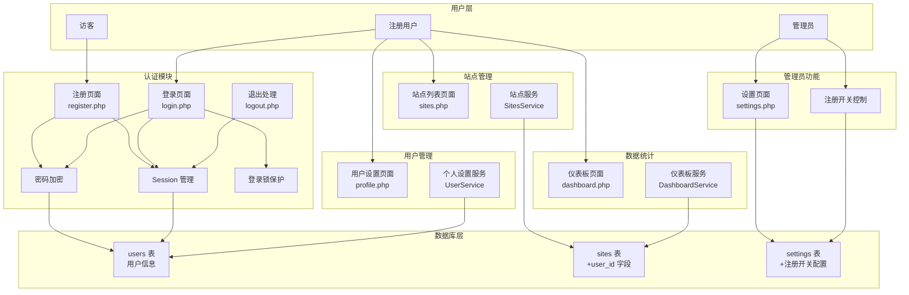

# 用户中心设计与实现

Feature Name: user-center-auth
Updated: 2026-06-10

## Description

为 JefCounts 极简统计系统添加完整的用户中心功能，包括用户注册、登录、退出、个人设置，以及管理控制注册开关功能。每个注册用户可管理多个网站的统计数据，实现多用户 SaaS 化的统计服务。

## Architecture



### 架构说明

1. **认证层**: 基于现有 `app/auth.php` 扩展，新增注册、登录锁、密码加密功能
2. **业务层**: 新增 UserService 处理用户相关业务逻辑，扩展 SitesService 支持 user_id
3. **数据层**: 新增 users 表，扩展 sites 表增加 user_id 外键，扩展 settings 表存储注册开关配置
4. **表现层**: 新增注册页面、用户设置页面，改造登录页面支持多用户、设置页面增加注册开关

## Components and Interfaces

### 新增组件

#### 1. UserService.php
**位置**: `src/Services/UserService.php`

**方法**:
- `register($username, $email, $password)`: 用户注册
- `login($username, $password, $remember)`: 用户登录，返回登录结果
- `logout()`: 退出登录，销毁 Session
- `getUserByUsername($username)`: 根据用户名查询用户
- `getUserByEmail($email)`: 根据邮箱查询用户
- `getUserById($id)`: 根据 ID 查询用户
- `getCurrentUserId()`: 获取当前登录用户 ID
- `updateProfile($userId, $data)`: 更新用户资料
- `changePassword($userId, $oldPassword, $newPassword)`: 修改密码
- `updateLastLogin($userId, $ip)`: 更新最后登录信息
- `checkLoginLock($username)`: 检查用户是否被登录锁定
- `incrementLoginAttempts($userId)`: 增加登录失败次数

#### 2. 新增视图文件
- `views/register.php`: 用户注册页面
- `views/profile.php`: 用户个人设置页面
- 改造 `views/login.php`: 支持多用户登录（移除硬编码 admin 检查）

#### 3. 新增 API 接口
- `public/api/auth/register.php`: 处理注册请求
- `public/api/auth/login.php`: 处理登录请求
- `public/api/auth/logout.php`: 处理退出请求
- `public/api/user/profile.php`: 处理用户资料更新
- `public/api/user/password.php`: 处理密码修改

### 扩展组件

#### 1. SettingsService.php
**扩展**: 增加注册开关相关方法

**新增方法**:
- `isRegistrationAllowed()`: 检查是否允许注册
- `toggleRegistration($enabled)`: 切换注册开关

#### 2. SitesService.php
**扩展**: 增加 user_id 过滤

**修改方法**:
- `getAllSites()`: 增加`$userId` 参数，普通用户只能获取自己的站点
- `createSite($userId, $data)`: 创建站点时关联 user_id
- `deleteSite($userId, $siteId)`: 删除时验证站点归属

#### 3. DashboardService.php
**扩展**: 增加用户权限验证

所有统计查询需验证用户对 siteId 的所有权

### 外部接口

#### Settings 设置表扩展
在现有 JSON 设置文件中增加配置项:
```php
[
    "allow_registration" => false  // 是否允许用户注册
]
```

## Data Models

### Users 表
```sql
CREATE TABLE users (
    id INT UNSIGNED AUTO_INCREMENT PRIMARY KEY,
    username VARCHAR(50) NOT NULL UNIQUE COMMENT '用户名',
    email VARCHAR(191) NOT NULL UNIQUE COMMENT '邮箱',
    password_hash VARCHAR(255) NOT NULL COMMENT '密码哈希',
    role ENUM('user', 'admin') NOT NULL DEFAULT 'user' COMMENT '用户角色',
    last_login_at TIMESTAMP NULL DEFAULT NULL COMMENT '最后登录时间',
    last_login_ip VARCHAR(45) DEFAULT NULL COMMENT '最后登录 IP',
    login_attempts INT UNSIGNED DEFAULT 0 COMMENT '登录失败次数',
    locked_until TIMESTAMP NULL DEFAULT NULL COMMENT '锁定截止时间',
    created_at TIMESTAMP DEFAULT CURRENT_TIMESTAMP COMMENT '创建时间',
    updated_at TIMESTAMP DEFAULT CURRENT_TIMESTAMP ON UPDATE CURRENT_TIMESTAMP COMMENT '更新时间',
    INDEX idx_username (username),
    INDEX idx_email (email),
    INDEX idx_role (role)
) ENGINE=InnoDB DEFAULT CHARSET=utf8mb4 COLLATE=utf8mb4_unicode_;
```

### Sites 表扩展
```sql
ALTER TABLE sites 
ADD COLUMN user_id INT UNSIGNED NOT NULL COMMENT '所属用户 ID' AFTER id,
ADD CONSTRAINT fk_sites_user_id FOREIGN KEY (user_id) REFERENCES users(id) ON DELETE CASCADE,
ADD INDEX idx_user_id (user_id);
```

### 默认管理员账户
```sql
-- 初始化时创建默认 admin 账户（密码在安装时设置）
INSERT INTO users (username, email, password_hash, role) 
VALUES ('admin', 'admin@localhost', '<bcrypt_hash_during_install>', 'admin');
```

### Settings 配置
现有 `admin.json` 或 `settings.json` 中增加:
```json
{
    "allow_registration": false
}
```

## Correctness Properties

### 1. 用户名唯一性
- 注册时必须保证 username 在 users 表中唯一
- 通过数据库 UNIQUE 索引和应用层校验双重保证

### 2. 邮箱唯一性
- 同一邮箱只能绑定一个账户
- 邮箱修改时必须验证唯一性

### 3. 站点归属权
- 每个站点必须归属于一个 user_id
- 用户只能访问、修改、删除自己的站点
- 管理员可以访问所有站点

### 4. 密码安全
- 密码必须使用 bcrypt 加密存储
- 密码长度至少 8 位
- 修改密码必须验证原密码

### 5. Session 安全
- Session ID 必须使用安全的随机数生成
- Session 必须设置 HttpOnly 和 SameSite
- Session 有效期为 2 小时，可选择 7 天记住登录

### 6. 登录锁保护
- 连续失败 5 次锁定 15 分钟
- 锁定时间内禁止登录尝试
- 成功登录后重置失败计数器

## Error Handling

### 1. 注册错误
- 用户名已存在：返回"用户名已被使用"
- 邮箱已注册：返回"该邮箱已注册账户"
- 密码强度不足：返回"密码长度至少 8 位"
- 注册关闭：返回"当前系统关闭了用户注册"

### 2. 登录错误
- 用户名不存在：返回"用户名或密码错误"（不暴露用户名是否存在）
- 密码错误：返回"用户名或密码错误"，记录失败次数
- 账户被锁定：返回"账户已锁定，请 15 分钟后再试"

### 3. 权限错误
- 未授权访问：重定向到登录页面
- 越权操作：返回 403 Forbidden
- Session 过期：返回"登录已过期，请重新登录"

### 4. 操作错误
- 删除不存在的站点：返回 404 Not Found
- 修改他人站点：返回 403 Forbidden
- 删除有数据的站点：提示"该站点包含统计数据，确认删除？"

## Test Strategy

### 单元测试
1. **UserService 测试**:
   - 注册功能：正常注册、重复用户名、重复邮箱、弱密码
   - 登录功能：正确登录、错误密码、锁定账户
   - 密码修改：正确修改、错误原密码

2. **权限测试**:
   - 用户只能访问自己的站点
   - 管理员可访问所有站点
   - 未登录用户重定向到登录页

### 集成测试
1. **注册流程**: 填写表单 → 提交 → 验证邮件 → 自动登录 → 跳转仪表板
2. **登录流程**: 填写表单 → 提交 → 验证 → 创建 Session → 跳转仪表板
3. **站点管理**: 添加站点 → 查看统计 → 编辑信息 → 删除站点

### 安全测试
1. **SQL 注入**: 注册登录表单输入 SQL 注入 payload
2. **XSS 攻击**: 用户名、站点名输入 XSS payload
3. **CSRF 攻击**: 跨站请求修改密码、删除站点
4. **暴力破解**: 连续登录失败触发锁定

### 性能测试
1. **登录响应**: <100ms
2. **注册响应**: <200ms
3. **仪表板加载**: <1s（有数据情况下）

## Implementation Plan

### 第一阶段：数据库和核心服务（Priority: HIGH）
1. 创建 users 表和数据迁移脚本
2. 扩展 sites 表增加 user_id 字段
3. 实现 UserService 核心方法
4. 改造 SettingsService 增加注册开关

### 第二阶段：认证功能（Priority: HIGH）
1. 创建注册页面和 API
2. 改造登录页面支持多用户
3. 实现退出登录功能
4. 实现登录锁保护机制

### 第三阶段：站点管理扩展（Priority: HIGH）
1. 扩展 SitesService 增加 user_id 过滤
2. 改造 sites.php 页面显示用户自己的站点
3. 添加站点生成脚本功能

### 第四阶段：用户设置功能（Priority: MEDIUM）
1. 创建用户设置页面
2. 实现邮箱修改功能
3. 实现密码修改功能

### 第五阶段：管理员功能（Priority: MEDIUM）
1. 在 settings.php 添加注册开关 UI
2. 实现开关状态持久化
3. 控制注册入口显示/隐藏

### 第六阶段：测试和优化（Priority: MEDIUM）
1. 编写集成测试脚本
2. 安全性测试和修复
3. 性能优化和压力测试

## References

[^1]: (现有认证系统) - [app/auth.php](../../app/auth.php)
[^2]: (现有设置服务) - [src/Services/SettingsService.php](../../src/Services/SettingsService.php)
[^3]: (现有站点服务) - [src/Services/SitesService.php](../../src/Services/SitesService.php)
[^4]: (登录页面) - [views/login.php](../../views/login.php)
[^5]: (设置页面) - [views/settings.php](../../views/settings.php)
